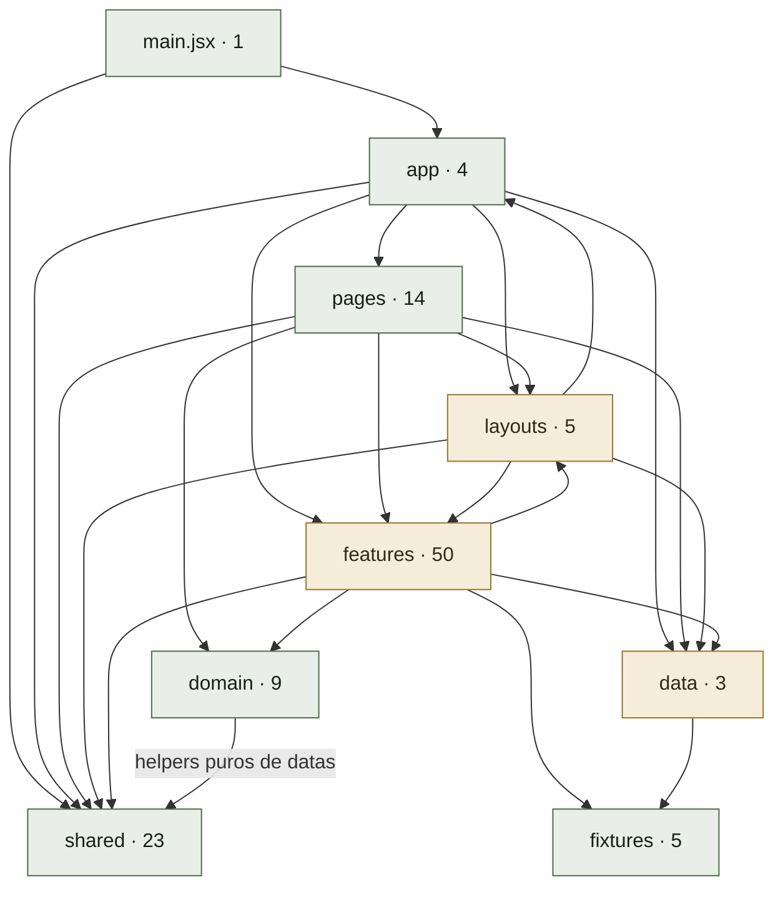

# Apollo Rigor

A Apollo Rigor é uma plataforma para uma loja de alfaiataria e trajes de cerimônia. O projeto reúne a experiência de quem procura um terno para uma ocasião especial e a rotina da equipe que cuida do atendimento, das peças e das locações.

A proposta é acompanhar a escolha do traje desde o primeiro contato com a coleção até o pedido, a prova, os ajustes e a devolução. Para casamentos, a plataforma também organiza os trajes do grupo e o acompanhamento dos participantes.

## A experiência do cliente

A vitrine apresenta os modelos da loja com fotografias, características e opções de compra ou locação. O cliente pode conhecer a coleção, escolher um traje, enviar uma solicitação e acompanhar seus pedidos na área da conta.

Para noivos e grupos de casamento, o projeto oferece a montagem de um pacote de trajes e uma área de acompanhamento do casamento, com informações sobre os participantes e as etapas do atendimento.

## A gestão da loja

A área de gestão concentra o trabalho diário do ateliê:

- **Dashboard:** pendências para resolver e próximas retiradas e devoluções.
- **Pedidos:** avaliação das solicitações recebidas pela vitrine.
- **Catálogo e estoque:** cadastro dos modelos, tamanhos e quantidades de peças.
- **Vendas e locações:** registro das operações avulsas e dos pacotes de casamento.
- **Agenda:** acompanhamento dos eventos e das movimentações dos trajes.
- **Ateliê:** controle dos ajustes, reparos e devoluções.

A vitrine e a gestão utilizam o mesmo catálogo, permitindo que as mudanças feitas pela equipe apareçam na experiência do cliente.

## O provador virtual

O provador permite escolher um terno da coleção e preparar uma foto usando a câmera do dispositivo ou enviando uma imagem. É possível trocar o modelo, refazer a foto e conferir a seleção antes de seguir.

Nesta versão, a prévia mostra a foto e o traje lado a lado, identificados como demonstração. A aplicação do terno na imagem por inteligência artificial depende de uma integração futura.

## Identidade e interface

O projeto segue uma direção de alfaiataria contemporânea: fotografia dos trajes em destaque, tipografia sóbria e cores de papel, tinta e latão. A interface oferece temas claro e escuro e se adapta a celulares, tablets e computadores.

A vitrine privilegia a apresentação da coleção. A gestão prioriza leitura, organização e acesso às tarefas do dia. Ambas compartilham componentes e padrões de interação.

## Estado atual do projeto

Esta entrega corresponde ao **frontend**, com fluxos de demonstração. Ainda não há backend, banco de dados remoto ou autenticação real. As operações são mantidas no navegador e podem ser sincronizadas entre abas do mesmo navegador, mas não entre dispositivos ou usuários.

No provador, a foto fica somente na memória da página: não é enviada nem persistida. A câmera é solicitada por ação do usuário e desligada ao fechar, sair da página ou ocultar a aba.

## Tecnologias

- React e React Router para interface e navegação.
- Vite para desenvolvimento e build.
- Tailwind CSS 3.4 e tokens compartilhados para estilização.
- ESLint para verificação de código.
- TypeScript para checagem dos contratos e mapas de estados selecionados.
- Node.js Test Runner e Playwright para testes unitários e de navegador.

## Como executar

Requer **Node.js 24 ou superior**.

```bash
npm install
npm run dev
```

Para gerar e visualizar a versão de produção:

```bash
npm run build
npm run preview
```

Os comandos utilizam as implementações oficiais de Rollup e esbuild em WebAssembly, permitindo executar o projeto no ambiente Windows em que os binários nativos são bloqueados pelo Application Control.

## Organização do código

| Pasta | Responsabilidade |
| --- | --- |
| `src/app` | Roteamento, navegação e composição da aplicação. |
| `src/layouts` | Estrutura das páginas públicas e da gestão. |
| `src/pages` | Páginas que compõem as funcionalidades. |
| `src/features` | Componentes e hooks organizados por funcionalidade. |
| `src/domain` | Regras de negócio, validações, seletores e estados. |
| `src/data` | Persistência local e atualização reativa. |
| `src/shared` | Componentes de interface e utilitários compartilhados. |
| `src/fixtures` | Conteúdo inicial de demonstração. |

A aplicação utiliza um único padrão de desenvolvimento, com domínio separado da interface e componentes compartilhados entre vitrine e gestão.

## Verificações

```bash
npm run lint
npm run typecheck
npm run check:architecture
npm test
npm run build
npm run test:e2e
```

A suíte atual possui 29 testes unitários e 29 testes de navegador. Os testes de navegador usam Microsoft Edge e precisam de um build atualizado; o Playwright inicia o preview quando necessário. A checagem de tipos tem escopo limitado aos arquivos definidos no `tsconfig.json`.

## Documentação técnica detalhada

- [Direção visual e padrões da interface](#direcao-visual)
- [Funcionamento do provador](#provador-tecnico)
- [Auditoria de arquitetura](#auditoria-de-arquitetura)
- [Reestruturação do frontend](#reestruturacao)

<a id="direcao-visual"></a>

## Direção visual e padrões da interface

Direção escolhida pelo usuário: alfaiataria contemporânea, sóbria, fotográfica e com personalidade. A paleta existente deve permanecer nos temas claro e escuro.

### Vitrine

A fotografia do traje é o foco. A abertura apresenta modelos reais do catálogo, com acesso direto aos detalhes. Composições fotográficas amplas alternam com catálogo compacto, informações do pacote e uma sequência vertical de atendimento. As etapas têm números porque representam a ordem do processo; categorias não recebem números decorativos.

Bodoni Moda compõe títulos e marca; IBM Plex Sans organiza navegação, formulários e descrições; IBM Plex Mono fica reservada a protocolos e dados operacionais. As fontes são locais, com `font-display: swap`. Títulos equilibram a quebra de linhas, sem palavras isoladas em outra cor.

As cores originais de papel, tinta e latão são preservadas. Ações principais usam o tom forte já existente para obter contraste legível, com o primeiro plano adequado a cada tema. Fotografias não recebem molduras decorativas, sombras ou animações automáticas. As superfícies usam mudanças sutis de tom; bordas separam controles e informações relacionadas.

Espaçamento em múltiplos de 4px. Conteúdo limitado ao contêiner compartilhado, com respiro maior entre seções e menor entre nome, tecido e preço de um produto. Controles de navegação, filtros, tema e fechamento têm alvos de pelo menos 44px.

### Fluxos de cliente e operação

Formulários mantêm o kit compartilhado, rótulos legíveis em caixa normal e estados de erro, foco e seleção. Filtros expõem `aria-pressed`; o menu móvel usa `details` e fecha com Escape. Os diálogos preservam contenção e retorno de foco.

A apresentação expressiva pertence à vitrine. O ERP continua concentrado em tarefas, tabelas, estados e dados. Não criar uma segunda arquitetura ou um segundo kit de controles para atender ao design.

O dashboard prioriza três filas de trabalho (devoluções atrasadas, pedidos para avaliar e ajustes) e as cinco próximas movimentações em ordem cronológica. O acervo e o valor das transações ficam em um disclosure fechado inicialmente. Contagens não simulam urgência: devoluções no dia não são atrasadas, integrantes que já devolveram não contam como pendentes e pedidos aprovados ou recusados saem da fila. Valores registrados não representam recebimentos conciliados.

Na área operacional inteira, Manrope compõe marca, títulos, textos, controles, cabeçalhos de tabela, datas, protocolos e números. A classe compartilhada `management-surface` redefine as famílias tipográficas e os tons de apresentação para os tokens existentes de tinta, papel e latão. Verde, azul, vermelho e demais cores de status não aparecem na gestão; os estados continuam identificados pelos seus rótulos. `ManagementSurfaceProvider` também transmite essa apresentação aos diálogos renderizados em portal. A vitrine mantém sua tipografia e seus tokens próprios dentro do mesmo kit compartilhado.

A navegação exibe apenas os destinos e a contagem de pedidos novos; não usa numeração decorativa, subtítulos repetidos, réguas ou gradientes. Acesso ao registro de devolução usa uma URL persistente, inclusive após recarregar a página.

O carregamento inicial e o das páginas usam a mesma apresentação: marca centralizada, mensagem de status e um segmento de latão em movimento. O HTML inicial compartilha as classes do componente React. A tela aparece apenas enquanto o código está chegando; não há tempo mínimo, porcentagem simulada ou atraso artificial. Em movimento reduzido, o indicador permanece estático.

### Conteúdo e imagens

Usar os dados do catálogo para nomes, tecidos, preços e disponibilidade. Não inventar depoimentos, números, selos ou fotografias de clientes. A abertura usa as imagens locais disponíveis; produtos cuja imagem falha continuam com um estado honesto de indisponibilidade da foto.

<a id="provador-tecnico"></a>

## Funcionamento do provador

A seção da home e o menu público levam a `/provador`. A seleção usa o catálogo reativo existente e aceita a URL `/provador?modelo=2`, incluindo reload e histórico. São exibidos os produtos de categoria `Terno`, sem copiar o catálogo para outra fonte.

### Foto e câmera

- `useProvadorPhoto` administra permissão, stream, captura, upload, descarte e erros.
- A câmera só abre por ação explícita. O pedido usa vídeo sem áudio; `playsInline` e vídeo mudo permitem o uso no celular.
- Os controles permitem capturar, refazer, fechar e solicitar outra câmera. O modo efetivamente reportado pelo dispositivo orienta o espelhamento.
- Capturar, fechar, sair da rota ou ocultar a aba encerra os tracks. Uma autorização que chega depois de cancelar também tem seu stream encerrado.
- Arquivos JPG, PNG e WebP até 10 MB são decodificados e convertidos a JPEG com o maior lado limitado a 1600px. Imagens ilegíveis têm erro explícito; HEIC precisa ser exportado em um formato aceito.
- A proporção original é preservada. A captura da câmera frontal acompanha a imagem espelhada da prévia.
- URLs de objetos são revogadas na troca, remoção e desmontagem. Não se usam localStorage, sessionStorage ou requisições de envio para a foto.

A câmera exige contexto seguro, como HTTPS ou localhost, além da permissão do navegador. Essas são exigências do [getUserMedia, documentadas pela MDN](https://developer.mozilla.org/en-US/docs/Web/API/MediaDevices/getUserMedia). A liberação do dispositivo usa [MediaStreamTrack.stop](https://developer.mozilla.org/en-US/docs/Web/API/MediaStreamTrack/stop).

### Integração futura

`Provador.jsx` reúne o modelo selecionado e `capture.photo`, que contém `{ blob, url, width, height, source }`. O `blob` JPEG e o identificador do produto são a entrada disponível para um futuro serviço de prova virtual; a URL `blob:` é uma referência local, não um endereço que um backend possa acessar.

Hoje `showPreview` apenas abre `FittingPreview`, com a foto e o traje lado a lado e um aviso explícito de demonstração. Não há serviço de IA, transformação da roupa, envio de fotos, chave de API, espera artificial nem resultado inventado. Para integrar o serviço, substituir essa ação por uma chamada ao contrato real, acrescentar seus estados de processamento/erro e apresentar a imagem retornada; o gerenciamento de câmera e foto permanece separado.

### Verificação

Os testes cobrem entrada pela home, permissão negada, upload e descarte, tipos inválidos e imagem ilegível, seleção por URL, catálogo vazio, prévia identificada como demonstração, captura com câmera simulada, liberação do stream e autorização atrasada após cancelamento. Capturas visuais cobrem 390px e 1440px nos dois temas; a suíte geral de responsividade também inclui a nova rota em 768px e 1024px.

<a id="auditoria-de-arquitetura"></a>

## Auditoria de arquitetura

Este registro descreve o momento em que a análise ou a migração foi realizada. Contagens, referências de linhas e resultados históricos abaixo não substituem o estado atual descrito no início deste README.

<details>
<summary>Consultar o registro completo</summary>

**Mode:** Architecture Audit
**Scope:** Frontend inteiro: grafo AST dos 114 módulos JS/JSX de src; leitura dirigida de roteamento, layouts, domínio, persistência, fluxos de pedidos/locações/devoluções, UI compartilhada, estilos e configurações. A leitura semântica concentrou-se nas fronteiras e nos módulos de maior acoplamento; não é uma revisão linha a linha de todos os arquivos.
**Health Score:** 83/100 — balanced: 100 − 3 × 5 − 2 × 1.
**Trend:** 30 → 83 (+53) over last 2 runs

**Follow-up:** Após esta auditoria, os três Warning abaixo foram corrigidos: devolução e ajuste em uma atualização, validação dos registros persistidos e definições centrais de contrato/pagamento. A pontuação de 83 descreve o momento da auditoria; não foi recalculada nesta correção. As duas sugestões permanecem como melhorias futuras.

Arquitetura significativamente mais alinhada: um único frontend, rotas reais, dados compartilhados e domínio sem dependência de UI. Nenhum Critical; três Warning e duas Suggestion. A pontuação avalia arquitetura, não garante ausência de bugs.

### Module Dependency Graph

Setas representam imports locais entre grupos, incluindo reexports e imports dinâmicos literais; contagens incluem módulos JS/JSX.



**Nenhum ciclo entre arquivos.** As relações recíprocas entre diretórios passam por arquivos diferentes: layouts usam navegação de app, enquanto Router compõe layouts; features usam layouts/Content, enquanto os layouts compõem features. Isso não é import circular.

Router tem o maior fan-out, 19 dependências locais: esperado para composição de rotas. cn.js tem o maior fan-in, 39 consumidores: utilitário pequeno e estável. As 888 linhas de fixtures/locacoes são dados; as 449 de ProdutoDrawer também não geraram achado apenas pelo tamanho.

### Findings

#### Critical

Nenhum identificado no escopo inspecionado.

#### Warning

**R6 — Devolução com ajuste não é uma operação indivisível**

**Symptom:** [useDevolucoes.js:50](src/features/ajustes/useDevolucoes.js#L50) e [useDevolucoes.js:84](src/features/ajustes/useDevolucoes.js#L84) executam setTrans e depois setAjustes. Cada setter persiste separadamente em [appData.js:28](src/data/appData.js#L28). Aprovação e criação de pacote já atualizam as coleções relacionadas em um único updateData.

**Source:** Evans, *Domain-Driven Design* — fronteira de consistência e invariantes de agregados. Uma devolução que exige costura deve registrar conjuntamente a devolução e a indisponibilidade correspondente; isso não exige classes de domínio.

**Consequence:** Se a primeira gravação funcionar e a segunda falhar, a aba mantém o ajuste em memória e apresenta aviso, mas recarregar recupera a devolução sem o ajuste. Uma simulação com o repositório real e storage que falha na segunda escrita confirmou esse estado parcial; não foi uma execução do hook no navegador.

**Remedy:** Calcular transação e ajuste juntos, publicando uma única atualização de snapshot. Verificar falha de persistência e indisponibilidade da peça após recarregar.

**R5 — A fronteira de persistência aceita registros inválidos como snapshot válido**

**Symptom:** [appData.js:17](src/data/appData.js#L17) verifica apenas se as quatro coleções são arrays. Um snapshot com produtos contendo null passa, embora [dashboard.js:12](src/domain/dashboard.js#L12) e as regras de estoque exijam registros completos. A migração de pedidos antigos em repository.js também valida apenas o array.

**Source:** McConnell, *Code Complete* — programação defensiva e validação nas fronteiras; Ousterhout, *A Philosophy of Software Design* — contrato confiável de um módulo.

**Consequence:** JSON válido com conteúdo incompatível atravessa a recuperação do repositório e pode derrubar a página em vez de produzir aviso. A reprodução com resumoDashboard confirmou “Cannot read properties of null (reading 'id')”.

**Remedy:** Validar registros, identificadores, variantes e estados permitidos na entrada do snapshot e nas migrações, tratando versões incompatíveis explicitamente. Conservar recuperação e aviso. A tipagem atual de estados não substitui validação de dados externos.

**R3 — Estados de contrato e pagamento ainda têm definições concorrentes**

**Symptom:** [statuses.js:13](src/domain/statuses.js#L13) define CONTRATO_STATUS, mas [useLocacoesActions.js:122](src/features/locacoes/useLocacoesActions.js#L122) repete a sequência para avançar contratos. [statuses.js:28](src/domain/statuses.js#L28) e [locacoes.js:2](src/domain/locacoes.js#L2) repetem os mesmos estados de pagamento.

**Source:** Hunt & Thomas, *The Pragmatic Programmer* — DRY aplicado ao conhecimento; Fowler, *Refactoring* — Duplicate Code. Trata-se de decisões de negócio duplicadas, não de rótulos repetidos na interface.

**Consequence:** Alterar o ciclo de assinatura ou adicionar um estado pode atualizar tipos e apresentação enquanto a ação continua usando a sequência antiga. A definição central ainda não governa todos os consumidores.

**Remedy:** Derivar opções de pagamento da definição central e definir a transição de contrato em um único módulo de domínio. Caso ordem visual e transição tenham significados diferentes, explicitar essa diferença.

#### Suggestion

**R5 — Primitivas de conteúdo dividem pasta com layouts de aplicação**

**Symptom:** [Content.jsx:1](src/layouts/Content.jsx#L1) contém apenas Section e Wrap, importados por sete features, incluindo [HomeColecao.jsx:1](src/features/home/HomeColecao.jsx#L1). SiteLayout e ErpLayout, na mesma pasta, compõem features e usam navegação de aplicação.

**Source:** Martin, *Clean Architecture* — direção de dependências e separação entre composição e componentes reutilizáveis; Brooks, *The Mythical Man-Month* — integridade conceitual.

**Consequence:** O significado de layouts fica ambíguo e o grafo agregado apresenta dependências recíprocas. Hoje não há ciclo de arquivos, mas fica mais difícil expressar uma regra simples de camadas.

**Remedy:** Mover as duas primitivas para o kit compartilhado, atualizar os sete consumidores e remover o arquivo substituído. Manter os layouts de aplicação como pontos de composição, sem criar outra implementação.

**R6 — Comandos de locação têm uma seam de teste menos clara que a aprovação**

**Symptom:** [useLocacoesActions.js:18](src/features/locacoes/useLocacoesActions.js#L18) reúne estado React, relógio, persistência global e comandos de venda/locação/pacote. Em contraste, domain/pedidos.js oferece uma transição pura de aprovação exercitada pelos testes unitários.

**Source:** Feathers, *Working Effectively with Legacy Code* — seams para executar comportamento sem infraestrutura; Evans, *Domain-Driven Design* — invariantes de negócio explícitos.

**Consequence:** Testar disponibilidade, baixa de estoque e criação conjunta de ajustes nesses comandos exige passar pelo hook ou extrair seu comportamento. Helpers de domínio e repositório já são testáveis; a lacuna está na composição das operações.

**Remedy:** Ao trabalhar nesses fluxos, extrair transições que recebem snapshot, comando e data; deixar o hook administrar interface e chamar o repositório. Testar conflitos de estoque e ajustes resultantes. Não é necessário criar uma camada nova ou um modelo orientado a objetos.

### Verification and alignment

| Verificação executada nesta auditoria | Resultado |
| --- | --- |
| Grafo AST independente | 114 módulos; nenhuma referência local inexistente; nenhum ciclo entre arquivos |
| npm run check:architecture | Passou; regras atuais de camadas respeitadas |
| npm run lint | Passou |
| npm run typecheck | Passou; limitado a types.d.ts, domain/statuses.js e shared/ui/status.js conforme tsconfig.json |
| npm test | 19 testes unitários passaram |
| npm run test:e2e | 20 testes de navegador passaram |
| npm run build | Passou com o launcher WASM existente |

A checagem automatizada de arquitetura usa expressões regulares e uma política parcial de camadas; foi complementada pelo grafo AST e leitura dos contratos. Os testes aprovados não cobrem todos os comandos de negócio nem garantem concorrência transacional entre abas.

As antigas implementações paralelas de site, components e stores foram removidas. Rotas, kit de UI, portal do cliente, dados públicos/ERP, diálogos e tema de gestão seguem padrões compartilhados. A gestão deriva da mesma paleta, com contexto de apresentação aplicado também aos diálogos em portal; não há uma segunda arquitetura de tema.

Conway's Law não foi pontuada: a estrutura de equipes não foi informada. Acesso por perfil e persistência local são contratos documentados de demonstração; não foram interpretados como autenticação ou backend de produção.

### Summary

O avanço de 30 para 83 reflete a remoção dos problemas estruturais principais, com um único padrão de desenvolvimento e domínio preservado. A prioridade é tornar a devolução com ajuste indivisível, seguida da validação dos snapshots e da unificação dos estados; as sugestões podem acompanhar esse trabalho. Esta execução registrou o diagnóstico, preservou a [auditoria anterior](docs/audits/2026-09-28-before-refactor.md) e atualizou o histórico, sem modificar a aplicação.

</details>

<a id="reestruturacao"></a>

## Reestruturação do frontend

Este registro descreve o momento em que a análise ou a migração foi realizada. Contagens, referências de linhas e resultados históricos abaixo não substituem o estado atual descrito no início deste README.

<details>
<summary>Consultar o registro completo</summary>

### Resultado

Uma única arquitetura e um único sistema visual: rotas compõem features; hooks mantêm estado/ações; domínio mantém regras; dados mantêm persistência; componentes básicos e tokens são compartilhados. Todos os consumidores foram atualizados e as implementações substituídas foram removidas.

### Migrações principais

| Origem | Destino consolidado |
| --- | --- |
| App, Root e Site monolíticos | app/Router, navigation e layouts SiteLayout/ErpLayout |
| components/Dashboard, Estoque, Pedidos, Ajustes, Anuario, Locacoes | pages/erp e componentes/hooks em features |
| site/Home, Colecao, Pedido, Pacote, Entrar, Conta, Casamento | pages/site; seções da home, formulários e conta em features |
| components/UI e site/ui; kits intermediários shared/ui/erp e shared/ui/site | shared/ui/Button, Form, Feedback, Surfaces, Typography, Controls, Modal, Dialog, Tape, Table e Progress |
| constants e logic | domain, fixtures, shared/lib e tokens centrais |
| store/pedidos e site/auth | features/pedidos/store e features/conta/session sobre repositórios de data |
| site/PortalNoivo e preview duplicado | features/locacoes/PortalNoivo compartilhado com PortalPreview |
| ThemeContext | shared/ui/ThemeProvider |
| statusMaps e cores de status locais | domain/statuses + types e shared/ui/status + Badge |
| estilos inline e shared/ui/layouts.css | Tailwind e src/index.css, única entrada de estilos |

Também foram removidos os arquivos intermediários `shared/ui/erp.jsx`, `site.jsx`, `tokens.js`, `statusMaps.js`, `layouts.css` e `app/ThemeContext.jsx`. Eles não coexistem com os substitutos.

### Verificações

- Lint sem avisos, incluindo componentes JSX não declarados, imports/variáveis sem uso, hooks e proibição de estilos inline fora de ProgressFill.
- TypeScript valida as uniões de status e os mapas de apresentação, incluindo suas chaves e tons.
- 108 módulos JavaScript/JSX verificados: imports existentes, camadas respeitadas e ausência de ciclos.
- Build de produção Vite/PostCSS validado com ferramentas WASM registradas no projeto. Os comandos `dev`, `build` e `preview` usam o carregador versionado para evitar os binários bloqueados pelo Application Control do Windows.
- 17 testes unitários e 14 testes de navegador: navegação/histórico, persistência, aprovações, edição de catálogo entre abas, dialogs, formulário de compra e pacote.
- Rotas principais verificadas em 390, 768, 1024 e 1440px, temas claro/escuro, com screenshots inspecionados. Tabelas rolam dentro do contêiner; grades e menus se adaptam ao espaço disponível.

### Exceções isoladas e limites preservados

ProgressFill usa somente a variável CSS `--progress` para percentuais contínuos. Texturas e escrita vertical usam regras CSS centrais. Diálogos restauram foco e bloqueio de rolagem. Nenhuma página ou feature define estilos inline.

Os dados, campos, regras de cálculo, perfis de demonstração, estado persistido e fluxos existentes foram mantidos. O projeto continua sendo uma demonstração sem backend ou autenticação real. Não foi convertido integralmente para TypeScript: a verificação de tipos é dirigida aos contratos e mapas de status.

### Arquivos modificados

- [.gitignore](.gitignore)
- [package-lock.json](package-lock.json)
- [package.json](package.json)
- [src/index.css](src/index.css)
- [src/main.jsx](src/main.jsx)

### Arquivos criados ou migrados

Esta lista inclui arquivos novos e destinos físicos das migrações; a tabela acima identifica a origem das migrações maiores.

- [.brooks-lint-history.json](.brooks-lint-history.json)
- [Auditoria de arquitetura](#auditoria-de-arquitetura)
- [README.md](README.md)
- [eslint-frontend-rules.js](eslint-frontend-rules.js)
- [eslint.config.js](eslint.config.js)
- [playwright.config.js](playwright.config.js)
- [postcss.config.js](postcss.config.js)
- [scripts/check-architecture.mjs](scripts/check-architecture.mjs)
- [scripts/portable-tools.mjs](scripts/portable-tools.mjs)
- [src/app/Router.jsx](src/app/Router.jsx)
- [src/app/StorageStatus.jsx](src/app/StorageStatus.jsx)
- [src/app/navigation.js](src/app/navigation.js)
- [src/app/useSiteNavigation.js](src/app/useSiteNavigation.js)
- [src/data/appData.js](src/data/appData.js)
- [src/data/repository.js](src/data/repository.js)
- [src/data/useData.js](src/data/useData.js)
- [src/domain/agenda.js](src/domain/agenda.js)
- [src/domain/catalog.js](src/domain/catalog.js)
- [src/domain/ids.js](src/domain/ids.js)
- [src/domain/locacoes.js](src/domain/locacoes.js)
- [src/domain/pacotes.js](src/domain/pacotes.js)
- [src/domain/pedidos.js](src/domain/pedidos.js)
- [src/domain/rules.js](src/domain/rules.js)
- [src/domain/statuses.js](src/domain/statuses.js)
- [src/domain/types.d.ts](src/domain/types.d.ts)
- [src/features/agenda/AgendaView.jsx](src/features/agenda/AgendaView.jsx)
- [src/features/agenda/CalendarioUI.jsx](src/features/agenda/CalendarioUI.jsx)
- [src/features/agenda/DayView.jsx](src/features/agenda/DayView.jsx)
- [src/features/agenda/MonthView.jsx](src/features/agenda/MonthView.jsx)
- [src/features/agenda/WeekView.jsx](src/features/agenda/WeekView.jsx)
- [src/features/agenda/calendar.js](src/features/agenda/calendar.js)
- [src/features/ajustes/Devolucoes.jsx](src/features/ajustes/Devolucoes.jsx)
- [src/features/ajustes/PainelAtelie.jsx](src/features/ajustes/PainelAtelie.jsx)
- [src/features/ajustes/useDevolucoes.js](src/features/ajustes/useDevolucoes.js)
- [src/features/catalog/EstoqueItens.jsx](src/features/catalog/EstoqueItens.jsx)
- [src/features/catalog/EstoqueResumo.jsx](src/features/catalog/EstoqueResumo.jsx)
- [src/features/catalog/ProdutoCard.jsx](src/features/catalog/ProdutoCard.jsx)
- [src/features/catalog/ProdutoDrawer.jsx](src/features/catalog/ProdutoDrawer.jsx)
- [src/features/catalog/ProdutoModal.jsx](src/features/catalog/ProdutoModal.jsx)
- [src/features/catalog/siteData.js](src/features/catalog/siteData.js)
- [src/features/conta/MeusPedidos.jsx](src/features/conta/MeusPedidos.jsx)
- [src/features/conta/PerfilForm.jsx](src/features/conta/PerfilForm.jsx)
- [src/features/conta/session.js](src/features/conta/session.js)
- [src/features/conta/usePerfilForm.js](src/features/conta/usePerfilForm.js)
- [src/features/home/HomeAtelie.jsx](src/features/home/HomeAtelie.jsx)
- [src/features/home/HomeColecao.jsx](src/features/home/HomeColecao.jsx)
- [src/features/home/HomeHero.jsx](src/features/home/HomeHero.jsx)
- [src/features/home/HomePacotes.jsx](src/features/home/HomePacotes.jsx)
- [src/features/home/HomePassos.jsx](src/features/home/HomePassos.jsx)
- [src/features/locacoes/CategoriaCard.jsx](src/features/locacoes/CategoriaCard.jsx)
- [src/features/locacoes/Historico.jsx](src/features/locacoes/Historico.jsx)
- [src/features/locacoes/IntegranteModal.jsx](src/features/locacoes/IntegranteModal.jsx)
- [src/features/locacoes/LocacaoAvulsa.jsx](src/features/locacoes/LocacaoAvulsa.jsx)
- [src/features/locacoes/LocacaoPadronizada.jsx](src/features/locacoes/LocacaoPadronizada.jsx)
- [src/features/locacoes/PacoteDetalhe.jsx](src/features/locacoes/PacoteDetalhe.jsx)
- [src/features/locacoes/PacoteVisaoGeral.jsx](src/features/locacoes/PacoteVisaoGeral.jsx)
- [src/features/locacoes/PacotesPadronizados.jsx](src/features/locacoes/PacotesPadronizados.jsx)
- [src/features/locacoes/ParticipanteRow.jsx](src/features/locacoes/ParticipanteRow.jsx)
- [src/features/locacoes/PortalNoivo.jsx](src/features/locacoes/PortalNoivo.jsx)
- [src/features/locacoes/PortalPreview.jsx](src/features/locacoes/PortalPreview.jsx)
- [src/features/locacoes/VendaAvulsa.jsx](src/features/locacoes/VendaAvulsa.jsx)
- [src/features/locacoes/useLocacoesActions.js](src/features/locacoes/useLocacoesActions.js)
- [src/features/locacoes/usePacoteDetalhe.js](src/features/locacoes/usePacoteDetalhe.js)
- [src/features/pedidos/Confirmacao.jsx](src/features/pedidos/Confirmacao.jsx)
- [src/features/pedidos/PacoteSolicitacao.jsx](src/features/pedidos/PacoteSolicitacao.jsx)
- [src/features/pedidos/PedidoCheckout.jsx](src/features/pedidos/PedidoCheckout.jsx)
- [src/features/pedidos/PedidoDetalhe.jsx](src/features/pedidos/PedidoDetalhe.jsx)
- [src/features/pedidos/RastreioPedido.jsx](src/features/pedidos/RastreioPedido.jsx)
- [src/features/pedidos/ResumoLinha.jsx](src/features/pedidos/ResumoLinha.jsx)
- [src/features/pedidos/store.js](src/features/pedidos/store.js)
- [src/features/pedidos/usePacoteForm.js](src/features/pedidos/usePacoteForm.js)
- [src/features/pedidos/usePedidoForm.js](src/features/pedidos/usePedidoForm.js)
- [src/fixtures/ajustes.js](src/fixtures/ajustes.js)
- [src/fixtures/catalogo.js](src/fixtures/catalogo.js)
- [src/fixtures/locacoes.js](src/fixtures/locacoes.js)
- [src/fixtures/pedidos.js](src/fixtures/pedidos.js)
- [src/fixtures/perfis.js](src/fixtures/perfis.js)
- [src/layouts/Content.jsx](src/layouts/Content.jsx)
- [src/layouts/ErpLayout.jsx](src/layouts/ErpLayout.jsx)
- [src/layouts/ErpSidebar.jsx](src/layouts/ErpSidebar.jsx)
- [src/layouts/SiteLayout.jsx](src/layouts/SiteLayout.jsx)
- [src/layouts/SiteNav.jsx](src/layouts/SiteNav.jsx)
- [src/pages/NotFound.jsx](src/pages/NotFound.jsx)
- [src/pages/erp/Ajustes.jsx](src/pages/erp/Ajustes.jsx)
- [src/pages/erp/Anuario.jsx](src/pages/erp/Anuario.jsx)
- [src/pages/erp/Dashboard.jsx](src/pages/erp/Dashboard.jsx)
- [src/pages/erp/Estoque.jsx](src/pages/erp/Estoque.jsx)
- [src/pages/erp/Locacoes.jsx](src/pages/erp/Locacoes.jsx)
- [src/pages/erp/Pedidos.jsx](src/pages/erp/Pedidos.jsx)
- [src/pages/site/Casamento.jsx](src/pages/site/Casamento.jsx)
- [src/pages/site/Colecao.jsx](src/pages/site/Colecao.jsx)
- [src/pages/site/Conta.jsx](src/pages/site/Conta.jsx)
- [src/pages/site/Entrar.jsx](src/pages/site/Entrar.jsx)
- [src/pages/site/Home.jsx](src/pages/site/Home.jsx)
- [src/pages/site/Pacote.jsx](src/pages/site/Pacote.jsx)
- [src/pages/site/Pedido.jsx](src/pages/site/Pedido.jsx)
- [src/shared/lib/cn.js](src/shared/lib/cn.js)
- [src/shared/lib/dates.js](src/shared/lib/dates.js)
- [src/shared/lib/format.js](src/shared/lib/format.js)
- [src/shared/lib/images.js](src/shared/lib/images.js)
- [src/shared/lib/useMediaQuery.js](src/shared/lib/useMediaQuery.js)
- [src/shared/lib/validation.js](src/shared/lib/validation.js)
- [src/shared/ui/Button.jsx](src/shared/ui/Button.jsx)
- [src/shared/ui/Controls.jsx](src/shared/ui/Controls.jsx)
- [src/shared/ui/Dialog.jsx](src/shared/ui/Dialog.jsx)
- [src/shared/ui/Feedback.jsx](src/shared/ui/Feedback.jsx)
- [src/shared/ui/Form.jsx](src/shared/ui/Form.jsx)
- [src/shared/ui/Modal.jsx](src/shared/ui/Modal.jsx)
- [src/shared/ui/Progress.jsx](src/shared/ui/Progress.jsx)
- [src/shared/ui/Surfaces.jsx](src/shared/ui/Surfaces.jsx)
- [src/shared/ui/Table.jsx](src/shared/ui/Table.jsx)
- [src/shared/ui/Tape.jsx](src/shared/ui/Tape.jsx)
- [src/shared/ui/ThemeProvider.jsx](src/shared/ui/ThemeProvider.jsx)
- [src/shared/ui/ThemeToggle.jsx](src/shared/ui/ThemeToggle.jsx)
- [src/shared/ui/Typography.jsx](src/shared/ui/Typography.jsx)
- [src/shared/ui/palette.js](src/shared/ui/palette.js)
- [src/shared/ui/status.js](src/shared/ui/status.js)
- [tailwind.config.js](tailwind.config.js)
- [tests/e2e/catalog.spec.js](tests/e2e/catalog.spec.js)
- [tests/e2e/frontend.spec.js](tests/e2e/frontend.spec.js)
- [tests/e2e/requests.spec.js](tests/e2e/requests.spec.js)
- [tests/e2e/responsive.spec.js](tests/e2e/responsive.spec.js)
- [tests/unit/navigation.test.js](tests/unit/navigation.test.js)
- [tests/unit/repository.test.js](tests/unit/repository.test.js)
- [tsconfig.json](tsconfig.json)
- [Reestruturação do frontend](#reestruturacao)

### Implementações originais removidas

- `src/App.jsx`
- `src/Root.jsx`
- `src/ThemeContext.jsx`
- `src/components/Ajustes.jsx`
- `src/components/Anuario.jsx`
- `src/components/Dashboard.jsx`
- `src/components/Estoque.jsx`
- `src/components/Locacoes.jsx`
- `src/components/Pedidos.jsx`
- `src/components/UI.jsx`
- `src/constants.js`
- `src/logic.js`
- `src/site/Casamento.jsx`
- `src/site/Colecao.jsx`
- `src/site/Confirmacao.jsx`
- `src/site/Conta.jsx`
- `src/site/Entrar.jsx`
- `src/site/Home.jsx`
- `src/site/Pacote.jsx`
- `src/site/Pedido.jsx`
- `src/site/PortalNoivo.jsx`
- `src/site/ProdutoModal.jsx`
- `src/site/RastreioPedido.jsx`
- `src/site/Site.jsx`
- `src/site/SiteNav.jsx`
- `src/site/auth.js`
- `src/site/siteData.js`
- `src/site/ui.jsx`
- `src/store/pedidos.js`

</details>
