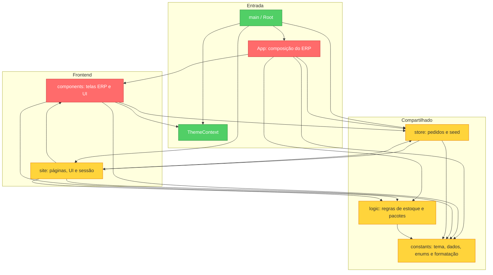

# Brooks-Lint Review

**Mode:** Architecture Audit  
**Scope:** frontend completo: 30 arquivos JS/JSX de `src`, CSS global, manifesto, configuração Vite e fallback Vercel. Grafo de imports relativos examinado integralmente; leitura aprofundada dos pontos de entrada, navegação, armazenamento e telas principais; demais implementações amostradas.  
**Health Score:** 30/100  
**Trend:** First run — no trend data

Há páginas e componentes separados, mas as fronteiras entre navegação, estado, regras e apresentação são insuficientes e produzem inconsistências concretas.

## Module Dependency Graph

Setas representam dependências entre módulos agregados. As dependências recíprocas entre diretórios não constituem um ciclo entre arquivos: `store/pedidos.js` importa `site/auth.js`, que não importa o store.

## Findings

### Critical

**R2 — Fontes de dados divergentes entre ERP e vitrine**

**Symptom:** `src/App.jsx:27–29` mantém produtos, transações e ajustes somente em `useState`. `src/site/siteData.js:5` expõe `PRODUTOS_INIT` como catálogo, e `src/site/auth.js:49–51` busca o pacote em `TRANS_INIT`. Em `src/components/Pedidos.jsx:63–66`, a aprovação cria uma transação em memória e persiste o status e o `transId` no store de pedidos.

**Source:** The Pragmatic Programmer — Orthogonality; A Philosophy of Software Design — Information Leakage.

**Consequence:** atualizar catálogo ou participantes no ERP não atualiza a vitrine. Ao recarregar, as transações criadas desaparecem, enquanto pedidos aprovados continuam apontando para seus IDs persistidos. A ligação entre pedido e transação deixa de ser confiável.

**Remedy:** estabelecer uma fonte compartilhada de dados para produtos, transações, ajustes e pedidos. Encapsular a aprovação em uma operação que salve transação e vínculo com consistência. Para a demonstração, um repositório local persistente basta; não é necessário inventar uma arquitetura de backend para começar.

**R1 — Módulo de locações concentra fluxos com responsabilidades distintas**

**Symptom:** `src/components/Locacoes.jsx` tem 1.038 linhas: histórico, venda, locação avulsa, cadastro e gestão de pacotes, edição de participante, preview do portal, devolução/ajustes e alterações do estoque. Exemplos: `VendaAvulsa:79`, `LocacaoPadronizada:205`, `EditarIntegranteModal:569`, `PortalNoivoPreview:607`, `PacoteDetalhe:723`, composição e mutações em `Locacoes:946`. Não se trata apenas de JSX longo: decisões de negócio e apresentação coexistem no mesmo módulo.

**Source:** Refactoring — Divergent Change; Clean Architecture — Single Responsibility Principle.

**Consequence:** mudanças no portal, pagamentos, devoluções ou estoque exigem compreender e editar o mesmo arquivo. As regras ficam difíceis de verificar separadamente, e tarefas independentes disputam o mesmo módulo.

**Remedy:** organizar uma feature de locações com componentes coesos para cada fluxo, seletores e operações de negócio separados. A página deve compor esses elementos. Fazer a extração por responsabilidade, mantendo comportamento, em vez de dividir arbitrariamente por tamanho.

### Warning

**R4 — Navegação manual não preserva o contrato da URL**

**Symptom:** `src/site/Site.jsx:18–49` implementa resolução de hashes e sincronização manual de `view`. Argumentos, rascunho e produto aberto vivem fora da URL (`28–30`). No ERP, `src/App.jsx:23–25` lê o hash apenas na montagem, mas o clique em `63` altera somente estado. `src/Root.jsx:7` aceita qualquer pathname iniciado por `/sistema`; outros caminhos são encaminhados à vitrine, sem resolução de páginas nem tela de rota desconhecida.

**Source:** A Philosophy of Software Design — Strategic vs. Tactical Programming; The Mythical Man-Month — Conceptual Integrity.

**Consequence:** no ERP, entrar em outra tela e recarregar volta à tela definida pelo hash inicial ou ao dashboard; a URL não identifica a tela atual. Na vitrine, contexto mantido em memória se perde ao recarregar e não é reconstruído pelo histórico. Um endereço como `/colecao` cai na home quando não há hash correspondente.

**Remedy:** centralizar rotas por pathname, com layouts da vitrine e do ERP, rotas desconhecidas e parâmetros para detalhes. Usar query string para filtros/abas que devem ser compartilháveis. Reservar `#como-funciona` e `#atelie` para âncoras dentro da home. O fallback em `vercel.json` já existe, mas não substitui o roteamento no cliente.

**R5 — Store compartilhado depende da implementação da vitrine**

**Symptom:** `src/store/pedidos.js:8` importa `PERFIS` de `src/site/auth.js` para gerar os pedidos de demonstração (`132–135`). O ERP depende desse store, e `src/site/SiteNav.jsx:3` importa `ThemeToggle` do arquivo que também reúne a UI do ERP.

**Source:** Clean Architecture — Stable Dependencies Principle; The Mythical Man-Month — Conceptual Integrity.

**Consequence:** o mecanismo compartilhado de pedidos depende da configuração de sessão específica de uma interface. Alterações da demo ou da sessão afetam consumidores do ERP. O controle de tema compartilhado fica vinculado ao módulo visual do sistema interno.

**Remedy:** mover fixtures e perfis de demonstração para um módulo próprio e executar o seed na composição da aplicação. Colocar o controle de tema em UI compartilhada. Definir a direção: páginas dependem de features e recursos compartilhados; recursos compartilhados não dependem de páginas.

**R2 — `constants.js` mistura categorias de mudanças**

**Symptom:** `src/constants.js` reúne tokens de tema (`1–31`), mapas visuais de status, categorias/tamanhos, formatação (`107–108`), produtos (`116`), transações (`151`) e ajustes. Foi a dependência com mais ocorrências de imports relativos na análise: 17. `logic.js:1` depende desse mesmo arquivo para `largerSizes`.

**Source:** Refactoring — Divergent Change; A Philosophy of Software Design — Information Hiding.

**Consequence:** apresentação, dados de exemplo e regras compartilham um ponto de manutenção sem uma responsabilidade clara. A camada de regras herda uma dependência sobre um módulo que contém também detalhes visuais e fixtures.

**Remedy:** separar tokens visuais, constantes e regras de cada feature, formatação compartilhada e fixtures. Manter os helpers de tamanho junto às regras que os usam. Não é necessário criar um arquivo para cada constante.

**R3 — Portal e preview repetem decisões do mesmo domínio**

**Symptom:** `src/components/Locacoes.jsx` define `categoriasDoGrupo:192` e `PortalNoivoPreview:607`; `src/site/PortalNoivo.jsx` define outra `categoriasDoGrupo:20` e sua própria apresentação do portal. As duas áreas interpretam integrantes e informações do traje, mas uma recebe produtos atuais e a outra usa o catálogo inicial.

**Source:** The Pragmatic Programmer — DRY; A Philosophy of Software Design — Information Leakage.

**Consequence:** alterar categorias, dados apresentados ou comportamento do traje exige revisar os dois caminhos. O preview não garante que o cliente verá as mesmas informações, especialmente depois de mudanças no catálogo do ERP.

**Remedy:** extrair seletores compartilhados que produzam os dados do portal a partir do pacote e do catálogo atual. Compartilhar a apresentação quando o comportamento for equivalente; manter controles específicos de cada interface nos seus adaptadores.

**R5 — Persistência sem ponto de substituição e falhas silenciosas**

**Symptom:** `src/store/pedidos.js:21–35` chama diretamente `localStorage` e eventos globais. O `catch` de gravação afirma manter dados em memória, mas não existe um armazenamento alternativo: o evento dispara e os hooks leem novamente o storage. `src/site/auth.js:77–84` também ignora falhas de gravação.

**Source:** Working Effectively with Legacy Code — The Seam Model; Code Complete — Defensive Programming.

**Consequence:** a interface pode exibir confirmação de um pedido que não foi armazenado. Testes isolados dependem dos globais do navegador, e mudar o mecanismo de persistência exige alterar o módulo que também implementa hooks e comportamento de pedidos.

**Remedy:** introduzir um adaptador de armazenamento substituível e separar o repositório dos hooks. Retornar sucesso/erro para os consumidores. Se a demo precisar de fallback em memória, implementá-lo explicitamente e compartilhar esse snapshot com as leituras.

**R2 — Área do cliente não acompanha o store reativo de pedidos**

**Symptom:** `src/site/Conta.jsx:50–53` chama `listPedidos()` durante o render, sem usar `usePedidos()`. O store oferece assinatura dos eventos locais e entre abas em `src/store/pedidos.js:95–109`, usada pelo ERP. O acompanhamento recebe o objeto selecionado da lista.

**Source:** The Pragmatic Programmer — Orthogonality; Refactoring — Shotgun Surgery.

**Consequence:** a aprovação ou recusa em outra aba não provoca atualização da conta. Lista e detalhe podem continuar mostrando o status anterior até ocorrer outro render ou remontagem.

**Remedy:** usar uma assinatura reativa comum. Manter o ID/protocolo selecionado e derivar o pedido do snapshot atual, em vez de manter uma cópia do objeto como fonte do detalhe.

**R4 — Navegação mobile oculta opções sem oferecer substituição**

**Symptom:** `src/index.css:123–125` oculta `.site-nav-links` abaixo de 620px. Em `src/site/SiteNav.jsx:19–22`, essa área contém Coleção e Como funciona, sem menu alternativo. O ERP mantém sidebar de 240px (`src/App.jsx:43`), além de espaçamentos fixos no conteúdo. Há regras responsivas pontuais, mas não um tratamento equivalente da navegação.

**Source:** Code Complete — Design in Construction; A Philosophy of Software Design — Strategic vs. Tactical Programming.

**Consequence:** opções desaparecem da navegação mobile, e a sidebar do ERP consome grande parte da largura disponível. O resultado visual exato precisa ser validado no navegador.

**Remedy:** definir navegação mobile explícita para a vitrine e um comportamento recolhível para o ERP. Verificar os fluxos em larguras pequenas, incluindo formulários, tabelas e detalhes de pacotes.

**R3 — Sobreposições repetidas sem contrato de acessibilidade**

**Symptom:** `src/components/UI.jsx:239–323` oferece Modal e Drawer com Escape e fechamento por clique, mas sem semântica de diálogo, captura/restauração do foco ou isolamento do fundo. `src/site/ProdutoModal.jsx:18–24` repete a gestão de Escape e altera diretamente o overflow do body, também sem um contrato completo de foco.

**Source:** The Pragmatic Programmer — DRY; Software Engineering at Google — Code Sustainability.

**Consequence:** o teclado pode alcançar conteúdo atrás da sobreposição e leitores de tela não recebem uma identificação adequada do diálogo. Cada implementação exige a mesma correção e pode voltar a divergir.

**Remedy:** adotar uma base compartilhada de diálogo acessível com título associado, foco inicial, contenção e restauração de foco, controle do fundo e Escape. Modal de produto e drawer preservam suas apresentações sobre essa base.

## Summary

Prioridade: corrigir a fonte de dados e a consistência da aprovação; estabelecer rotas e layouts; extrair as responsabilidades de locações e retirar fixtures da infraestrutura compartilhada. Depois, consolidar seletores do portal, assinatura reativa e primitivas de navegação/sobreposição.

O uso de SPA ou hashes não é, por si só, um erro. Aqui, os problemas demonstráveis são perda de contexto, navegação do ERP sem URL correspondente e fontes divergentes de dados. Há componentes e exports válidos; trocar default exports por named exports ou adicionar barrels não resolveria essas causas.

**Verificação e limites:** nenhum caminho relativo importado por `from` ficou sem arquivo correspondente e nenhum ciclo entre arquivos foi encontrado. A existência de cada named export não foi validada por compilação. Não foi executado build nem teste de navegador: `node_modules` está ausente. O manifesto oferece apenas dev/build/preview, sem scripts de lint ou testes. Não há configuração `.brooks-lint.yaml` nem `AGENTS.md` no projeto. Estrutura de equipes desconhecida: avaliação de Conway não aplicada. R6 foi considerado; dados simples e fixtures não justificam exigir entidades ricas neste frontend.

**Pontuação:** 100 − (2 Critical × 15) − (8 Warning × 5) = 30. É uma métrica heurística da skill, não uma medida de funcionamento do produto.

**Arquitetura sugerida:** `app` para rotas e providers; `layouts` para as duas interfaces; `pages` para composição; `features` para catálogo, pedidos, locações, ajustes e conta; `shared/ui` e `shared/lib` para recursos comuns; `data` para repositórios/adaptadores; `fixtures` para demonstração. As pastas devem surgir conforme as extrações reais, evitando camadas vazias.
